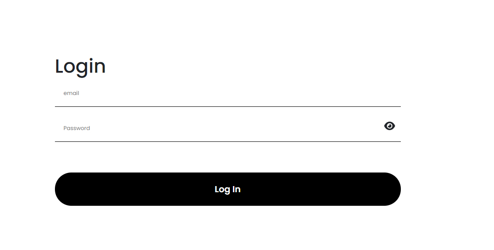
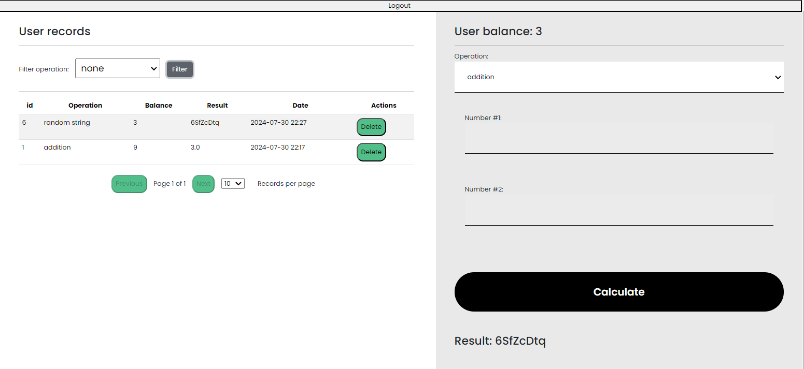

# Overview
This is the frontend for a simple calculator that can perform addition, substraction, multiply, division, square root and random string.
Users must authenticate first

# Some screenshots
screenshot 1 
screenshot 2 
# Getting Started
To get started with this project, clone the repository and install the dependencies.
1. Make sure you have Node.js and npm installed on your computer. When you download it, you need to configure path variables. You can download it here: https://nodejs.org/
2. Download the repository
3. Open the downloaded folder in your terminal of choice and write: npm install
4. After everything has installed write: npm run dev
5. Backend must be up and running
6. Frontend will be in port 5174 ( http://localhost:5174/)
